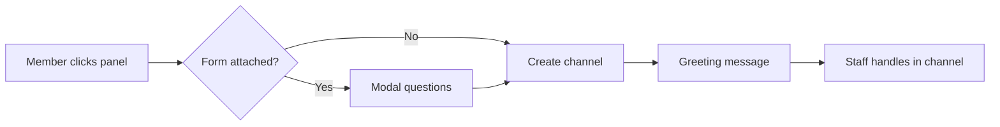

adore's ticket system lets you post a panel in a channel. Members click a button or pick from a dropdown to open a private channel with your team.

Setup uses **prefix commands** plus an **interactive panel manager** — there are no slash commands for tickets.

<Note>
  All ticket commands use the `ticket` group (alias `tickets`). They require **Manage Server** unless noted otherwise.
</Note>

## What you can configure

<AccordionGroup>
  <Accordion title="Limits" icon="server">
    - Up to **15** ticket panels per server
    - Up to **5 active** options per panel (more can be saved on standby)
    - Up to **25** forms per server, **5** fields per form
    - Up to **25** options shown on a deployed panel (Discord component limit)
  </Accordion>

  <Accordion title="Panels" icon="table-columns">
    - Button or dropdown display mode
    - Custom panel embed/message
    - Default and overflow categories
    - Per-user open ticket limits
    - Channel naming format and case IDs
  </Accordion>

  <Accordion title="Options" icon="list">
    - Label, emoji, button color, and dropdown description
    - Support and trainee roles
    - Required roles to open a ticket
    - Intake forms
    - Custom greeting, close, claim, reopen, and automation messages
    - Claim/close/reopen/delete button labels and styles
    - Category moves on claim or close
    - Channel rename templates
  </Accordion>

  <Accordion title="Server-wide settings" icon="gear">
    - Transcript channel (`,ticket transcript`)
    - Log channel (`,ticket log`)
    - Global staff role (`,ticket staff`)
  </Accordion>
</AccordionGroup>

---

## Quick setup

<Steps>
  <Step title="Create a panel">
    ```javascript
    ,ticket panel create Support
    ```

    Or run `,ticket panel` and click **Add** in the interactive manager.
  </Step>

  <Step title="Add at least one option">
    ```javascript
    ,ticket option create Support "General Help"
    ```

    You can also open the panel in the manager → **Options** → **Add**.
  </Step>

  <Step title="Configure (optional)">
    Run `,ticket panel`, select your panel, and use the buttons:

    - **Behaviour** — delete delay, max open tickets, claims toggle
    - **Categories** — where new ticket channels are created
    - **Display** — button vs dropdown mode, channel name format
    - **Message** — custom panel embed
    - **Options** — per-option roles, forms, messages, and behaviour
  </Step>

  <Step title="Deploy the panel">
    ```javascript
    ,ticket panel send Support #support
    ```

    This posts the panel with your active options. Redeploy after changing options or display mode.
  </Step>

  <Step title="Set transcript channel (recommended)">
    ```javascript
    ,ticket transcript #ticket-transcripts
    ```
  </Step>

  <Step title="Set log channel (recommended)">
    ```javascript
    ,ticket log #ticket-logs
    ```
  </Step>

  <Step title="Set staff role (recommended)">
    ```javascript
    ,ticket staff @Support
    ```
  </Step>
</Steps>

---

## How it works



1. A member uses your deployed panel (button or dropdown).
2. If the option has a form with fields, they answer questions in a Discord modal first.
3. adore creates a private channel, sets permissions for the creator and support roles, and sends a greeting.
4. Staff work in the channel. Action buttons (claim, close, reopen, delete) are configured per option in the panel manager.

---

## Next steps

| Guide | What it covers |
| ----- | -------------- |
| [Setup](/configuration/tickets/setup) | Panels, options, and the interactive manager in detail |
| [Commands](/configuration/tickets/commands) | Full command reference |
| [Forms](/configuration/tickets/forms) | Intake questions before a ticket opens |
| [Messages](/configuration/tickets/messages) | Custom embeds and template variables |
| [Staff & operations](/configuration/tickets/staff) | Roles, transcripts, logs, and ticket lifecycle |
