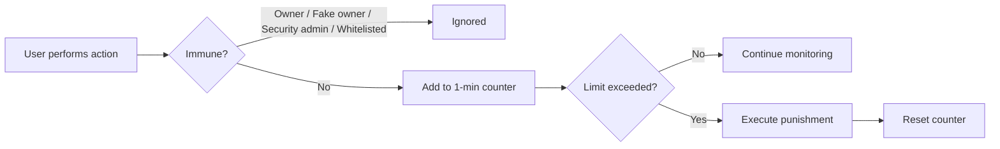

## Why use an antinuke system?

An antinuke system limits how many destructive actions a user can perform in a short time window. If the limit is exceeded, adore punishes the offender automatically — protecting your server from rogue moderators or compromised accounts.

## How antinuke works

When you enable a protection module, adore watches for harmful actions in real time:

1. **Detection** — adore listens to Discord audit logs (and message events for @everyone pings) to identify who performed each action
2. **Tracking** — each user's actions are counted in a **rolling 1-minute window** per module
3. **Threshold** — if a user exceeds the configured **limit** within that window, adore triggers a punishment
4. **Punishment** — the offender is automatically punished and their action counter resets



### Punishment types

| Punishment | What happens |
| ---------- | ------------ |
| `strip` | Removes all roles from the user (except @everyone and bot-managed roles). **Default.** |
| `kick` | Kicks the user from the server |
| `ban` | Bans the user from the server |

<Info>
  `strip` is the safest default — it neutralizes a rogue moderator without
  removing them from the server entirely.
</Info>

### What adore monitors

| Module | Trigger | Source |
| ------ | ------- | ------ |
| `ban` | Member banned | Audit log |
| `kick` | Member kicked | Audit log |
| `role` | Role created or deleted | Audit log |
| `channel` | Channel created or deleted | Audit log |
| `webhook` | Webhook created or deleted | Audit log |
| `everyone` | @everyone or @here ping sent | Message event |
| `permissions` | `administrator` or `manage_guild` granted to a member | Audit log |

## Who can configure antinuke?

| Role | Access |
| ---- | ------ |
| **Server owner** | Full access |
| **Fake owner** | Full access — see [Fake Owner](/security/fake-owner) |
| **Security admin** | Can configure antinuke and antiraid — see [Security Admins](/security/security-admins) |

<Warning>
  Discord's **mass ban** feature can ban 100+ members at once. Use [fake
  permissions](/security/fake-permissions) so moderators can only ban through
  adore, not native Discord.
</Warning>

## Who is immune to antinuke?

These users will **never** trigger antinuke punishments:

- **Server owner** (Discord owner)
- **[Fake owner](/security/fake-owner)** — your designated co-owner
- **Security admins** — automatically immune
- **Whitelisted users** — added via `,antinuke whitelist`

Everyone else — including administrators and moderators with full Discord perms — is subject to antinuke if they exceed limits.

## Exempting users

Add trusted bots or staff who need to perform bulk actions:

<CodeGroup>

```javascript Syntax
,antinuke whitelist (user or bot ID)
```

```javascript Example
,antinuke whitelist @trusted-mod
,antinuke whitelist 123456789012345678
```

</CodeGroup>

- Running the command again **toggles** the user off the whitelist
- View all whitelisted users with `,antinuke whitelists`
- The server owner cannot be whitelisted (already immune)

## Enabling a protection module

Each module is toggled independently with `on` or `off`.

### Available flags

<AccordionGroup>
  <Accordion title="Limit">
    Number of actions allowed per minute before punishment triggers. Range: **1–10**. Default: `3`.
    <Info>Recommended: keep between `1` and `6` for sensitive modules like ban and permissions.</Info>
    <CodeGroup>
    ```javascript Syntax
    --limit (number)
    ```
    ```javascript Example
    --limit 3
    ```
    </CodeGroup>
  </Accordion>
  <Accordion title="Punishment">
    What happens when the limit is exceeded: `strip`, `kick`, or `ban`. Default: `strip`.
    <CodeGroup>
    ```javascript Syntax
    --punishment (strip | kick | ban)
    ```
    ```javascript Example
    --punishment ban
    ```
    </CodeGroup>
  </Accordion>
</AccordionGroup>

### Available modules

<AccordionGroup>
  <Accordion title="Ban protection — ,antinuke ban">
    Triggers when a member is banned (via Discord or adore).
    <CodeGroup>
    ```javascript Syntax
    ,antinuke ban (on | off) [--limit (number)] [--punishment (strip | kick | ban)]
    ```
    ```javascript Example
    ,antinuke ban on --limit 3 --punishment ban
    ```
    </CodeGroup>
  </Accordion>
  <Accordion title="Kick protection — ,antinuke kick">
    Triggers when a member is kicked.
    <CodeGroup>
    ```javascript Syntax
    ,antinuke kick (on | off) [--limit (number)] [--punishment (strip | kick | ban)]
    ```
    ```javascript Example
    ,antinuke kick on --limit 3 --punishment ban
    ```
    </CodeGroup>
  </Accordion>
  <Accordion title="Role protection — ,antinuke role">
    Triggers on role creation **or** deletion (both share the same limit).
    <CodeGroup>
    ```javascript Syntax
    ,antinuke role (on | off) [--limit (number)] [--punishment (strip | kick | ban)]
    ```
    ```javascript Example
    ,antinuke role on --limit 3 --punishment ban
    ```
    </CodeGroup>
  </Accordion>
  <Accordion title="Channel protection — ,antinuke channel">
    Triggers on channel creation **or** deletion (both share the same limit).
    <CodeGroup>
    ```javascript Syntax
    ,antinuke channel (on | off) [--limit (number)] [--punishment (strip | kick | ban)]
    ```
    ```javascript Example
    ,antinuke channel on --limit 3 --punishment ban
    ```
    </CodeGroup>
  </Accordion>
  <Accordion title="Webhook protection — ,antinuke webhook">
    Triggers on webhook creation or deletion.
    <CodeGroup>
    ```javascript Syntax
    ,antinuke webhook (on | off) [--limit (number)] [--punishment (strip | kick | ban)]
    ```
    ```javascript Example
    ,antinuke webhook on --limit 3 --punishment ban
    ```
    </CodeGroup>
  </Accordion>
  <Accordion title="Everyone ping protection — ,antinuke everyone">
    Triggers when a user sends a message containing @everyone or @here.
    <CodeGroup>
    ```javascript Syntax
    ,antinuke everyone (on | off) [--limit (number)] [--punishment (strip | kick | ban)]
    ```
    ```javascript Example
    ,antinuke everyone on --limit 1 --punishment strip
    ```
    </CodeGroup>
  </Accordion>
  <Accordion title="Dangerous permissions — ,antinuke permissions">
    Triggers when `administrator` or `manage_guild` is granted to a member via role update.
    <CodeGroup>
    ```javascript Syntax
    ,antinuke permissions (on | off) [--limit (number)] [--punishment (strip | kick | ban)]
    ```
    ```javascript Example
    ,antinuke permissions on --limit 1 --punishment ban
    ```
    </CodeGroup>
  </Accordion>
</AccordionGroup>

Run any module command **without** `on`/`off` to see its current status, limit, and punishment.

## Viewing configuration

```javascript
,antinuke overview
```

Shows all enabled modules with their limits and punishments, plus security admin and whitelist counts.

## Recommended setup

For a typical server, start with:

```javascript
,antinuke ban on --limit 3 --punishment ban
,antinuke kick on --limit 3 --punishment ban
,antinuke role on --limit 3 --punishment ban
,antinuke channel on --limit 3 --punishment ban
,antinuke webhook on --limit 2 --punishment ban
,antinuke permissions on --limit 1 --punishment ban
,antinuke everyone on --limit 1 --punishment strip
```

Then set up [fake permissions](/security/fake-permissions) so staff can only moderate through adore.

<Info>
  Bot-add protection lives under [antiraid](/security/antiraid), not antinuke.
</Info>
